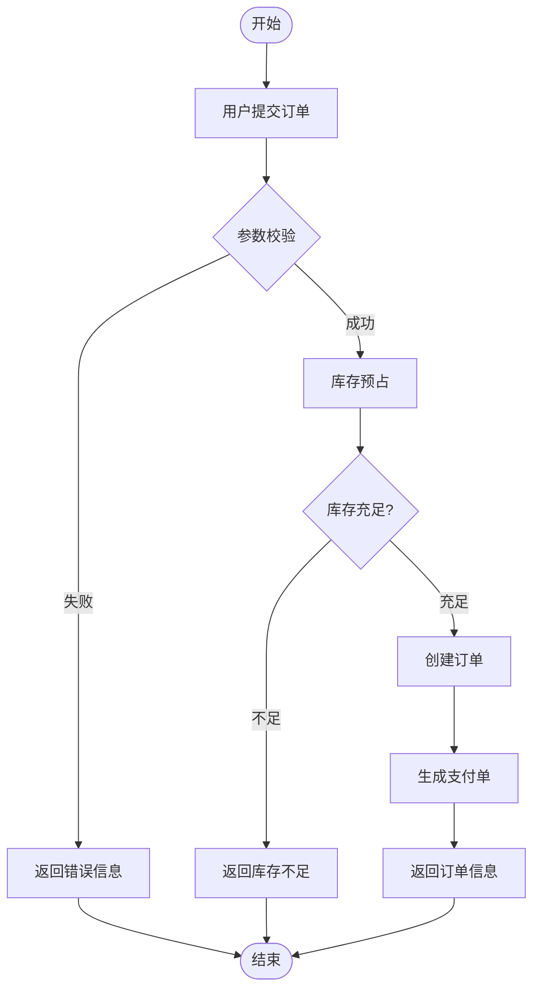
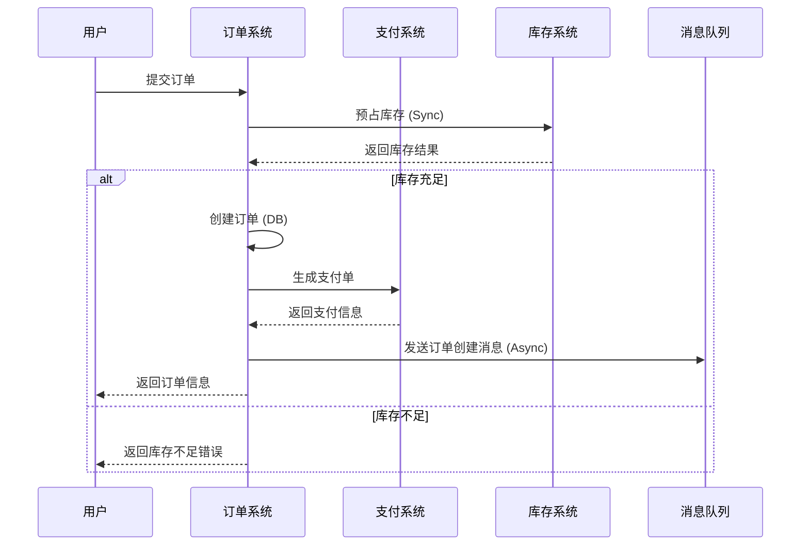
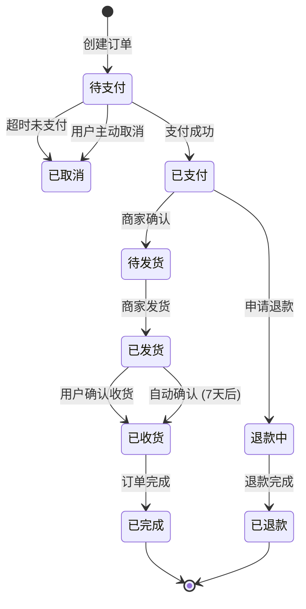
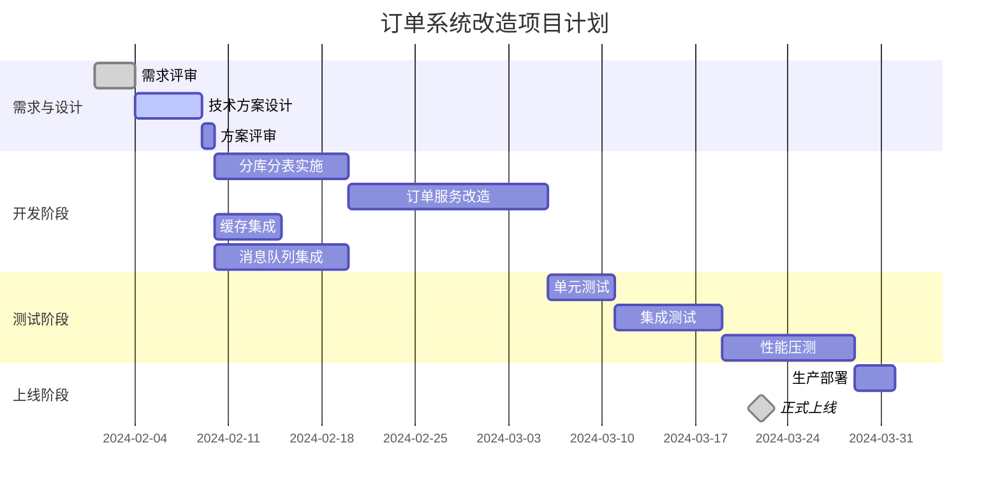
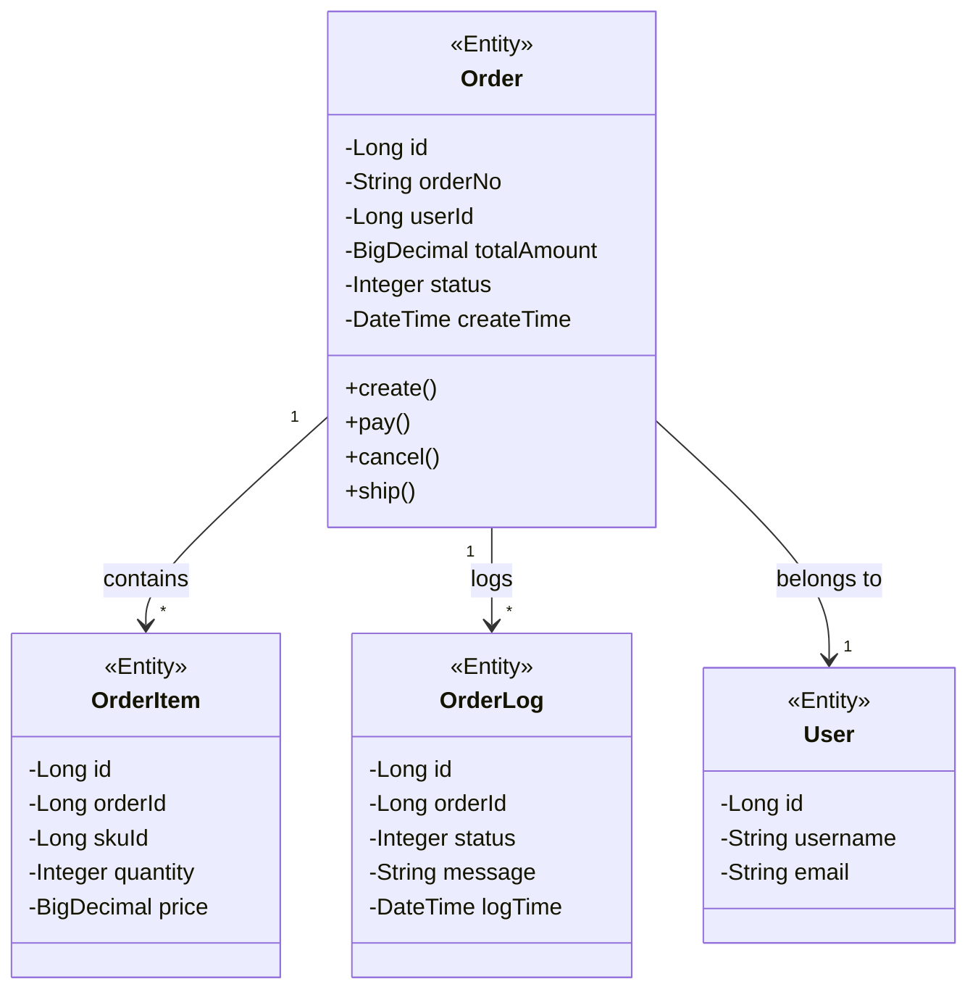
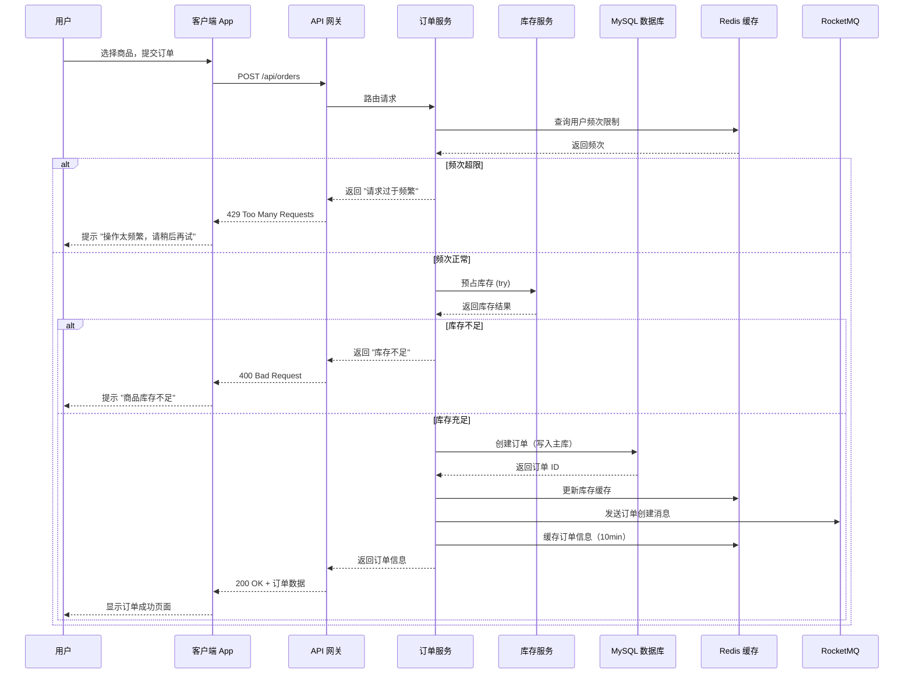

# 图表工具使用指南

本文档详细介绍如何在技术方案文档中使用 draw.io 和 c4-architecture 两大图表工具，包括工具选择、使用流程、格式要求等。

---

## 目录

1. [图表工具总览](#图表工具总览)
2. [draw.io 使用指南](#drawio-使用指南)
3. [c4-architecture 使用指南](#c4-architecture-使用指南)
4. [Mermaid 图表使用指南](#mermaid-图表使用指南)
5. [图表选择决策树](#图表选择决策树)
6. [图表管理规范](#图表管理规范)
7. [示例与模板](#示例与模板)

---

## 图表工具总览

### 工具对比

| 工具 | draw.io | c4-architecture | Mermaid |
|------|---------|-----------------|---------|
| **用途** | 通用架构图 | C4 模型图 | 代码生成图 |
| **输出格式** | .drawio + PNG | Markdown + Mermaid | Markdown + Mermaid |
| **适用场景** | 复杂架构图 | 软件架构文档 | 简单流程、时序 |
| **编辑方式** | 可视化拖拽 | 代码生成 | 代码生成 |
| **协作性** | 支持导入导出 | 代码版本管理 | 代码版本管理 |
| **学习成本** | 低 | 中 | 低 |
| **推荐度** | ⭐⭐⭐⭐⭐ | ⭐⭐⭐⭐⭐ | ⭐⭐⭐⭐ |

### 工具分工

#### draw.io 负责：
- 整体系统架构图
- 逻辑架构图
- 物理部署图
- 网络拓扑图
- 复杂业务流程图

#### c4-architecture 负责：
- C4 模型（上下文、容器、组件图）
- 系统边界定义
- 组件交互关系
- 架构分层展示

#### mermaid-diagrams skill 负责：
- 简单流程图
- 时序图（Sequence Diagram）
- 状态图
- 甘特图
- 关系图
- 类图（Class Diagram）

**重要原则**：不要使用"ascii码纯字符串"拼接模拟的图表，即便简单图表，也要调用对应的 skill（如 mermaid-diagrams）来生成专业图表。

---

## draw.io 使用指南

### 工具介绍

**draw.io**（现在叫 diagrams.net）是一个强大的免费在线图表绘制工具，适合绘制各类架构图。

### 使用流程

**流程图说明**：
- 步骤 1：调用 draw-io skill
- 步骤 2：描述图表需求
- 步骤 3：根据需求绘制图表
- 步骤 4：导出 .drawio 源文件
- 步骤 5：生成 PNG 预览图
- 步骤 6：保存到 assets/ 目录
- 步骤 7：在文档中引用

**注**：如需生成正式的流程图，请使用 mermaid-diagrams skill 创建专业的流程图，而不是使用ASCII字符模拟。

### 调用方式

#### 基本调用
```
请使用 draw-io skill 为我的系统架构绘制架构图
系统包含：API 网关、订单服务、库存服务、支付服务、Redis、MySQL
```

#### 详细调用（推荐）
```
请使用 draw-io skill 绘制订单系统架构图

需求：
- 展示完整的订单处理流程
- 包含：用户端、API 网关、订单服务（3 个实例）、
  库存服务、支付服务、消息队列、Redis 缓存、MySQL 分库分表
- 显示主要的数据流向
- 标注关键的技术组件
- 区分内外部系统

输出要求：
- .drawio 源文件
- PNG 预览图
- 命名为：order-system-architecture
```

### Output Format

#### 源文件格式
- **格式**：`order-system-architecture.drawio`
- **位置**：`assets/order-system-architecture.drawio`
- **用途**：保留可编辑源文件
- **版本管理**：纳入 Git 版本控制

#### 预览图格式
- **格式**：`order-system-architecture.png`
- **位置**：`assets/order-system-architecture.png`
- **用途**：Markdown 文档中直接显示
- **分辨率**：建议使用 300 DPI

### 引用方式

#### 方式 1：直接显示（推荐）
```markdown
### 3.1 整体架构


*图 1：订单系统整体架构图*

**架构说明**：
- 用户请求通过 API 网关路由
- 订单服务负责订单创建和管理
- 库存服务独立处理库存扣减
- 支付服务对接第三方支付
- Redis 缓存热点数据
- MySQL 采用 16 库 64 表的分片策略
```

#### 方式 2：链接引用
```markdown
### 3.1 整体架构

[查看架构图](./assets/order-system-architecture.png)

编辑源文件：[order-system-architecture.drawio](./assets/order-system-architecture.drawio)
```

#### 方式 3：占位符说明
```markdown
### 3.1 整体架构

【架构图待补充：见 assets/order-system-architecture.drawio】

**绘图要点**：
- 展示分层架构（接入层 → 服务层 → 数据层）
- 标注关键组件和调用关系
- 区分内外部系统边界
```

### 绘图规范

#### 图层规范
**建议使用以下图层分类**：

1. **外部系统层**（External Systems）
   - 用户端 App、Web
   - 第三方系统（支付、物流等）
   - 使用浅灰色或虚线边框区分

2. **接入层**（API Layer）
   - API 网关、负载均衡
   - 使用蓝色系

3. **服务层**（Service Layer）
   - 订单服务、库存服务、支付服务
   - 使用绿色系

4. **中间件层**（Middleware Layer）
   - 消息队列、缓存
   - 使用黄色系

5. **数据层**（Data Layer）
   - 关系型数据库、NoSQL
   - 使用红色系

6. **基础设施层**（Infrastructure Layer）
   - 服务器、容器、云平台
   - 使用灰色系

#### 样式规范
**颜色使用**：
- 尽量使用业务标准色系
- 同一层级用同色系的深浅区分
- 关键路径使用醒目颜色（红色）
- 避免使用过多颜色（不超过 6 种）

**字体规范**：
- 标题：14-16px，加粗
- 正文：12px，常规
- 图例：10px，斜体
- 字体：微软雅黑 / Arial

**线条规范**：
- 调用关系：实线箭头
- 异步消息：虚线箭头
- 数据流向：双线箭头
- 控制流：点划线箭头

#### 元素对齐
```markdown
要求：
- 组件之间对齐（左对齐、居中对齐）
- 等间距分布
- 箭头指向准确，避免交叉
- 使用网格辅助对齐（View > Grid）
- 元素大小统一，避免大小不一
```

### 最佳实践

#### 图例说明
每个架构图都应包含：
- **标题**：明确描述图表内容
- **图例**：解释颜色、符号含义
- **版本号**：如 `v1.0 2024-02-01`
- **备注**：特殊说明

**示例**：
```markdown
图例说明：
- 蓝色矩形：前端应用
- 绿色菱形：后端服务
- 黄色圆柱：缓存/消息队列
- 红色矩形：数据库
- 实线箭头：同步调用
- 虚线箭头：异步消息
- 灰色虚线：系统边界

版本：v1.0
更新：2024-02-01
```

#### 复杂架构分层展示
当架构较复杂时，使用多页展示：
- **第 1 页**：整体架构（高层视图）
- **第 2 页**：订单服务内部逻辑
- **第 3 页**：数据流向时序
- **第 4 页**：部署架构

#### 版本演进展示
对于架构演进方案：
- **左侧**：当前架构（红色线框）
- **右侧**：目标架构（绿色线框）
- **中间**：变化部分用黄色高亮

---

## c4-architecture 使用指南

### 工具介绍

**c4-architecture** skill 用于生成遵循 C4 模型的架构图，包括：
- **Context Diagram**（系统上下文图）
- **Container Diagram**（容器图）
- **Component Diagram**（组件图）
- **Code Diagram**（可选，代码级）

### C4 模型简介

**注意**：不要使用ASCII字符拼接模拟图表。C4模型图应通过 **c4-architecture skill** 生成专业的Mermaid图表。

**C4模型包含四个层次（自上而下）**：

1. **Context Diagram（系统上下文图）**
   - 展示系统与外部用户、系统的交互关系
   - 用途：定义系统边界，展示系统在整个IT环境中的位置

2. **Container Diagram（容器图）**
   - 展示系统的容器（应用、数据库、消息队列等）
   - 用途：展示系统的技术架构和主要技术选型

3. **Component Diagram（组件图）**
   - 展示容器内部的组件和交互
   - 用途：展示应用内部的模块划分和职责

4. **Code Diagram（代码图，可选）**
   - 展示组件内部的类结构（详细设计阶段）
   - 用途：展示具体的代码实现结构（类图级别）

**使用建议**：在技术方案概要设计中，通常需要生成前三个层次的图表（Context、Container、Component），根据需求调用相应的 skill。

**生成方式**：调用 **c4-architecture skill**，提供系统信息，自动生成的Mermaid图表可以直接嵌入Markdown文档。

### 使用流程

**流程说明**：
- 步骤 1：准备系统信息（系统名称、参与者、外部系统等）
- 步骤 2：调用 c4-architecture skill
- 步骤 3：提供必要信息（系统名称、组件列表等）
- 步骤 4：生成 Mermaid 图表代码
- 步骤 5：保存为 Markdown 文件
- 步骤 6：嵌入主文档或独立引用

**注**：如需生成正式的流程图，请使用 mermaid-diagrams skill 创建专业的流程图，而不是使用ASCII字符模拟。

### 调用方式

#### 生成系统上下文图
```
请使用 c4-architecture skill 生成订单系统的上下文图

系统信息：
- 系统名称：订单管理系统（Order Management System）
- 描述：负责订单创建、查询、管理的系统
- 用户：普通用户、商家、运营人员、管理员
- 外部系统：支付系统、库存系统、物流系统、消息通知服务

输出：系统上下文图的 Mermaid 代码
```

#### 生成容器图
```
请使用 c4-architecture skill 生成容器图

系统：订单管理系统
容器：
- Web 前端（React SPA）
- API 网关（Kong）
- 订单服务（Spring Boot）
- 库存服务（Spring Boot）
- 支付服务（Spring Boot）
- Redis 缓存
- MySQL 数据库
- 消息队列（RocketMQ）

输出：容器图的 Mermaid 代码
```

#### 生成组件图
```
请使用 c4-architecture skill 为订单服务生成组件图

订单服务内部组件：
- 订单 API 接口（REST Controller）
- 订单业务逻辑（Service）
- 订单数据访问（DAO/Mapper）
- 订单缓存管理（Cache Manager）
- 订单消息生产者（MQ Producer）

依赖：
- 调用库存服务客户端
- 调用支付服务客户端
- 连接 MySQL
- 连接 Redis

输出：组件图的 Mermaid 代码
```

### 输出格式

#### Markdown 文件
- **命名**：`order-system-c4-context.md`
- **位置**：`assets/order-system-c4-context.md`
- **内容**：Mermaid 图表代码 + 文字说明

**文件结构**：
```markdown
# 订单管理系统 - 系统上下文图

## 图表

```mermaid
C4_CONTEXT
  title 订单管理系统 - 系统上下文

  Person(user, "用户", "访问订单系统的普通用户")
  Person(merchant, "商家", "管理订单的商家")
  Person(admin, "管理员", "系统管理员")

  System(order_system, "订单管理系统", "负责订单的创建、查询和管理")

  System_Ext(payment, "支付系统", "第三方支付系统")
  System_Ext(inventory, "库存系统", "商品库存管理")
  System_Ext(logistics, "物流系统", "订单配送管理")

  Rel(user, order_system, "创建/查询订单")
  Rel(merchant, order_system, "管理订单")
  Rel(admin, order_system, "系统管理")
  Rel(order_system, payment, "支付请求")
  Rel(order_system, inventory, "库存扣减")
  Rel(order_system, logistics, "配送请求")
```

## 说明

### 参与者（Actors）

1. **用户**
   - 角色描述：普通用户
   - 主要操作：浏览商品、创建订单、查询订单、取消订单

2. **商家**
   - 角色描述：入驻商家
   - 主要操作：处理订单、发货、售后处理

3. **管理员**
   - 角色描述：平台运营人员
   - 主要操作：订单监控、异常处理、数据统计

### 外部系统

1. **支付系统**
   - 系统描述：第三方支付服务
   - 交互方式：通过 HTTP API 同步调用
   - 关键依赖：支付结果回调

2. **库存系统**
   - 系统描述：商品库存管理服务
   - 交互方式：通过 Dubbo 协议调用
   - 关键依赖：库存扣减、释放

3. **物流系统**
   - 系统描述：订单配送管理系统
   - 交互方式：通过消息队列异步通知
   - 关键依赖：物流状态更新

## 架构评估

### 优势
- 清晰的系统边界
- 明确的依赖关系
- 松耦合设计

### 改进建议
- 考虑支付系统故障的降级方案
- 库存系统调用增加熔断机制

## 版本历史
| 版本 | 日期 | 修订内容 |
|------|------|----------|
| v1.0 | 2024-02-01 | 初版 |
```

### 图表类型详解

#### 1. Context Diagram（系统上下文图）

**目的**：展示系统与外部世界的交互关系

```mermaid
C4_CONTEXT
  title 系统上下文图示例

  Person(person, "用户名称", "用户描述")
  System(system, "系统名称", "系统描述")
  System_Ext(ext_system, "外部系统", "外部系统描述")

  Rel(person, system, "关系描述")
  Rel(system, ext_system, "关系描述")
```

**使用场景**：
- 项目启动阶段，定义系统边界
- 与业务方确认交互关系
- 高层架构评审

**最佳实践**：
- 保持简洁，只显示直接交互
- 不要暴露内部实现细节
- 使用业务术语而非技术术语

#### 2. Container Diagram（容器图）

**目的**：展示系统内部的容器（应用、数据库、消息队列等）

```mermaid
C4_CONTAINER
  title 容器图示例

  Person(person, "用户")

  Container(web_app, "Web 应用", "React SPA", "用户界面")
  Container(api_gateway, "API 网关", "Kong", "路由、认证、限流")
  Container(service, "业务服务", "Spring Boot", "业务逻辑")
  Container(db, "数据库", "MySQL", "数据持久化")
  Container(cache, "缓存", "Redis", "热点数据")
  Container(mq, "消息队列", "RocketMQ", "异步解耦")

  Rel(person, web_app, "访问")
  Rel(web_app, api_gateway, "调用 API")
  Rel(api_gateway, service, "路由")
  Rel(service, db, "读写")
  Rel(service, cache, "读写")
  Rel(service, mq, "发布/订阅")
```

**使用场景**：
- 技术架构设计
- 技术选型说明
- 部署架构规划

**最佳实践**：
- 区分不同类型的容器（Web、Service、DB）
- 明确技术栈和用途
- 标注重要配置（Port、Protocol）

#### 3. Component Diagram（组件图）

**目的**：展示容器内部的主要组件和交互

```mermaid
C4_COMPONENT
  title 组件图示例 - 订单服务

  Container(order_service, "订单服务")

  Component(controller, "OrderController", "REST API", "处理 HTTP 请求")
  Component(service, "OrderService", "业务逻辑", "订单业务处理")
  Component(dao, "OrderDAO", "数据访问", "数据库操作")
  Component(cache_manager, "CacheManager", "缓存管理", "缓存读写")
  Component(mq_producer, "MQProducer", "消息生产者", "发送订单消息")

  Rel(controller, service, "调用")
  Rel(service, dao, "数据访问")
  Rel(service, cache_manager, "缓存操作")
  Rel(service, mq_producer, "发送消息")
```

**使用场景**：
- 详细设计说明
- 组件职责划分
- 接口定义参考

**最佳实践**：
- 只显示主要组件（5-10 个）
- 明确组件职责
- 显示关键交互关系

---

## Mermaid 图表使用指南

### Mermaid 简介

Mermaid 是一个通过类 Markdown 的文本语法生成图表的工具，支持：
- 流程图（flowchart）
- 时序图（sequenceDiagram）
- 状态图（stateDiagram）
- 甘特图（gantt）
- 类图（classDiagram）
- 饼图（pie）

### 流程图（Flowchart）

#### 使用场景
- 业务流程
- 数据处理流程
- 判断分支逻辑

#### 示例：订单创建流程
```markdown

```

### 时序图（Sequence Diagram）

#### 使用场景
- 系统间调用时序
- API 调用流程
- 组件交互过程

#### 示例：订单支付流程
```markdown

```

### 状态图（State Diagram）

#### 使用场景
- 订单状态流转
- 业务状态机
- 对象生命周期

#### 示例：订单状态流转
```markdown

```

### 甘特图（Gantt Chart）

#### 使用场景
- 项目计划
- 里程碑展示
- 资源排期

#### 示例：项目开发计划
```markdown

```

### 类图（Class Diagram）

#### 使用场景
- 领域模型设计
- 对象关系说明
- 数据结构定义

#### 示例：订单领域模型
```markdown

```

---

## 图表选择决策树

### 什么时候使用什么图表？

**图表选择决策流程**：

1. **需要绘制图表？**
   - 是否需要展示系统与外部交互关系？
     - 是 → 调用 **c4-architecture skill** 生成 Context Diagram（C4 模型）
     - 否 → 进入下一步

   - 是否需要展示系统内部模块？
     - 是 → 调用 **c4-architecture skill** 生成 Container Diagram（C4 模型）
     - 否 → 进入下一步

   - 是否需要展示模块内部组件？
     - 是 → 调用 **c4-architecture skill** 生成 Component Diagram（C4 模型）
     - 否 → 进入下一步

   - 是否需要可视化拖拽编辑？
     - 是 → 调用 **draw-io skill** 进行可视化绘制
     - 否 → 进入下一步

   - 是否需要展示流程？
     - 是 → 调用 **mermaid-diagrams skill** 生成 Flowchart（流程图）
     - 否 → 进入下一步

   - 是否需要展示时序？
     - 是 → 调用 **mermaid-diagrams skill** 生成 Sequence Diagram（时序图）
     - 否 → 进入下一步

   - 是否需要展示状态？
     - 是 → 调用 **mermaid-diagrams skill** 生成 State Diagram（状态图）
     - 否 → 考虑使用 **mermaid-diagrams skill** 的其他图表类型

**重要提示**：所有图表都应通过相应的 skill 生成，不要使用ASCII字符模拟图表。根据需求选择合适的 skill，确保图表的专业性和可维护性。

### 常见场景推荐

| 场景 | 推荐工具 | 图表类型 | 原因 |
|------|----------|----------|------|
| 系统边界定义 | c4-architecture | Context Diagram | 标准架构视图 |
| 技术架构设计 | c4-architecture | Container Diagram | 技术选型明确 |
| 组件设计 | c4-architecture | Component Diagram | 职责划分清晰 |
| 复杂架构手绘 | draw.io | 自定义 | 自由度高 |
| 业务流程 | Mermaid | Flowchart | 简单直观 |
| 调用时序 | Mermaid | Sequence Diagram | 标准表达 |
| 状态流转 | Mermaid | State Diagram | 状态清晰 |
| 项目计划 | Mermaid | Gantt Chart | 时间明确 |
| 数据模型 | Mermaid | Class Diagram | UML 标准 |

---

## 图表管理规范

### 文件命名规范

#### draw.io 文件
```
格式：{系统/模块}-{用途}-architecture.drawio

示例：
- order-system-architecture.drawio
- inventory-service-architecture.drawio
- payment-flow-architecture.drawio
```

#### C4 模型文件
```
格式：{系统}-{c4类型}.md

示例：
- order-system-c4-context.md
- order-system-c4-container.md
- order-system-c4-component.md
```

#### Mermaid 文件
```
格式：{主题}-{类型}.md

示例：
- order-flow-sequence.md
- order-state-stateDiagram.md
- project-plan-gantt.md
```

#### 预览图文件
```
格式：{同名}.png (从.drawio 导出)

示例：
- order-system-architecture.png
```

### 版本管理

#### 版本号命名
```
v{主版本}.{次版本}

例如：
v1.0 - 初版
v1.1 - 小幅调整
v2.0 - 架构重构
```

#### 版本记录
在图表文件头部记录版本信息：

```markdown
---
图表名称：订单系统架构图
版本：v1.0
创建日期：2024-02-01
作者：张三
---

# 订单系统架构图

## 版本历史

| 版本 | 日期 | 修订人 | 修订内容 |
|------|------|--------|----------|
| v1.0 | 2024-02-01 | 张三 | 初版 |
| v1.1 | 2024-02-05 | 李四 | 调整缓存位置 |
| v2.0 | 2024-02-10 | 王五 | 重构为微服务架构 |
```

### 图表更新流程

当文档修改导致架构变更时：

```
1. 确定变更影响范围
   ├─ 影响架构 → 需要更新图表
   ├─ 仅文字描述 → 无需更新
   └─ 技术选型变更 → 必须更新

2. 更新对应图表
   ├─ draw.io：打开原文件修改
   ├─ C4 模型：重新生成或手动修改
   └─ Mermaid：直接修改代码

3. 导出并保存
   ├─ draw.io：导出新版 .drawio 和 .png
   ├─ 覆盖原文件（保持文件名）
   └─ Git 提交变更

4. 更新版本号
   ├─ 小修改：v1.0 → v1.1
   └─ 大修改：v1.x → v2.0

5. 更新文档引用
   ├─ 修改文档中的引用文字（如有）
   └─ 确保图表说明与图表内容一致
```

### 图表一致性检查

#### 检查清单
- [ ] 图表与文档描述一致
- [ ] 所有组件在文档中都有说明
- [ ] 数据流向与实际逻辑一致
- [ ] 技术选型与方案一致
- [ ] 版本号与文档版本对应

#### 配套文件完整性
- [ ] draw.io 源文件（.drawio）
- [ ] PNG 预览图（.png）
- [ ] C4 模型文件（.md）
- [ ] 说明文档（在 .md 文件中）

### 存储与访问

#### 目录结构
```
project/
├── docs/
│   ├── SKILL.md                          # 主文档
│   ├── references/
│   │   ├── document-structure.md
│   │   ├── style-guide.md
│   │   ├── quality-checklist.md
│   │   └── diagram-tools.md
│   ├── assets/                           # 图表资源
│   │   ├── order-system-architecture.drawio
│   │   ├── order-system-architecture.png
│   │   ├── order-system-c4-context.md
│   │   ├── order-system-c4-container.md
│   │   ├── order-flow-sequence.md
│   │   └── order-state-stateDiagram.md
│   └── design/                           # 详细设计（可选）
│       ├── redis-design.md
│       └── microservice-design.md
```

#### 引用路径
**推荐使用相对路径**：
```markdown


[架构图源文件](./assets/order-system-architecture.drawio)

更多图表见 [assets/](./assets/) 目录
```

---

## 示例与模板

### 示例 1：完整架构图（draw.io）

#### 步骤 1：调用 draw.io
```
请为订单系统绘制架构图：

- 系统边界：虚线框
- 外部系统：用户端、支付、库存、物流
- 内部组件：
  * API 网关（Nginx + Lua）
  * 应用层：订单、库存、支付（各 3 个实例）
  * 中间件：Redis Cluster（3 主 3 从）
            RocketMQ（2 主 2 从）
  * 数据层：MySQL（16 库 64 表分片）
- 数据流向：标注主要调用链
- 防护：限流、熔断、降级组件
```

#### 步骤 2：嵌入文档
```markdown
### 3.1 整体架构


*图 1：订单系统整体架构图（v1.0）*

**架构说明**：

1. **接入层**
   - API 网关负责路由、认证、限流
   - Nginx 负载均衡

2. **应用层**
   - 订单、库存、支付微服务
   - 每个服务 3 实例部署

3. **中间件层**
   - Redis 缓存热点数据
   - RocketMQ 异步解耦

4. **数据层**
   - MySQL 分库分表存储
   - 16 个库，每库 64 张表

**源文件**：[order-system-architecture.drawio](./assets/order-system-architecture.drawio)
```

### 示例 2：C4 上下文图

**文件**：`assets/order-system-c4-context.md`

```markdown
# 订单管理系统 - 系统上下文

## C4 上下文图

```mermaid
C4_CONTEXT
  title 订单管理系统 - 系统上下文

  Person(user, "用户", "通过 App/小程序下单的普通用户")
  Person(merchant, "商家", "管理订单的入驻商家")
  Person(admin, "管理员", "平台的运营管理人员")

  System(order_system, "订单管理系统", "处理订单的全生命周期管理")

  System_Ext(payment, "支付系统", "微信支付/支付宝等第三方支付")
  System_Ext(inventory, "库存系统", "商品库存管理系统")
  System_Ext(logistics, "物流系统", "快递配送系统")
  System_Ext(notification, "通知服务", "短信/推送通知服务")

  Rel(user, order_system, "创建/查询/取消订单")
  Rel(merchant, order_system, "处理订单/发货/售后")
  Rel(admin, order_system, "监控/管理")

  Rel(order_system, payment, "发起支付/查询结果")
  Rel(order_system, inventory, "预占/扣减/释放库存")
  Rel(order_system, logistics, "创建配送单/跟踪物流")
  Rel(order_system, notification, "发送订单通知")

  UpdateLayoutConfig($c4ShapeInRow="4", $c4BoundaryInRow="2")
```

## 场景说明

### 用户下单流程
1. 用户浏览商品，点击购买
2. 订单系统校验库存
3. 系统创建待支付订单
4. 系统调用支付系统
5. 用户完成支付
6. 系统通知商家处理
7. 商家发货
8. 物流系统配送

## 关键依赖
- 支付系统可用性：99.9%
- 库存系统响应：< 100ms
- 通知服务到达率：99.5%

## 版本
**v1.0** 2024-02-01
```

### 示例 3：流程时序图

**文件**：`assets/order-sequence.md`

```markdown
# 订单创建流程 - 时序图



## 流程说明

### 1. 防刷限制
- 基于 Redis 实现用户频次限制
- 限制规则：每分钟最多创建 5 个订单

### 2. 库存预占
- 库存服务实现 Try-Confirm-Cancel 模式
- Try 阶段冻结库存，Confirm 扣减，Cancel 释放

### 3. 数据一致性
- 数据库主库写入，保证数据持久化
- Redis 缓存提升查询性能
- MQ 异步通知下游系统

### 关键指标
- 接口响应时间：P99 < 200ms
- 库存预占成功率：> 99.9%
- 缓存命中率：> 85%
```

### 示例 4：图表索引

建议在文档末尾添加图表索引：

```markdown
## 附录 A：图表索引

| 编号 | 图表名称 | 类型 | 文件位置 | 版本 |
|------|----------|------|----------|------|
| 图 1 | 订单系统整体架构图 | draw.io | assets/order-system-architecture.drawio | v1.0 |
| 图 2 | 系统上下文图 | C4 Context | assets/order-system-c4-context.md | v1.0 |
| 图 3 | 容器图 | C4 Container | assets/order-system-c4-container.md | v1.0 |
| 图 4 | 订单服务组件图 | C4 Component | assets/order-service-c4-component.md | v1.0 |
| 图 5 | 订单创建流程图 | Mermaid Flowchart | assets/order-flow.md | v1.0 |
| 图 6 | 时序图 | Mermaid Sequence | assets/order-sequence.md | v1.0 |
| 图 7 | 状态图 | Mermaid State | assets/order-state.md | v1.0 |
| 图 8 | 项目计划 | Mermaid Gantt | assets/project-plan.md | v1.0 |

## 附录 B：配套文件清单

- [架构图源文件](./assets/order-system-architecture.drawio)
- [C4 上下文图](./assets/order-system-c4-context.md)
- [C4 容器图](./assets/order-system-c4-container.md)
- [C4 组件图](./assets/order-service-c4-component.md)
- [流程图](./assets/)
```

---

## 总结

### 图表使用最佳实践

1. **选择合适的工具**
   - 复杂架构：draw.io
   - 软件架构：c4-architecture
   - 简单图表：Mermaid

2. **保持简洁**
   - 每张图聚焦一个主题
   - 避免信息过载
   - 分层展示复杂架构

3. **规范命名**
   - 使用统一的命名规则
   - 文件名反映内容和版本
   - 便于查找和管理

4. **版本管理**
   - 保留源文件（.drawio）
   - 记录版本历史
   - 确保文档一致

5. **配套说明**
   - 每张图都有文字说明
   - 解释关键设计决策
   - 标注重要信息

### 常见问题

**Q1: 什么时候用 draw.io，什么时候用 C4 模型？**
A: 如果需要精确控制和复杂布局，用 draw.io；如果是标准架构文档，用 C4 模型。

**Q2: 图表太多怎么办？**
A: 按层次组织（高层 → 详细），在文档中按需引用，太多可单独建图表索引。

**Q3: 如何保证图表版本一致？**
A: 每次修改文档后检查相关图表，建立变更 checklist，更新版本号。

**Q4: 图表需要多详细？**
A: 概要设计阶段，图表应展示主要组件和关系，不过度展开细节。

---

*本指南与 Skill.md 中的"图表工具使用指南"章节配套使用。*
