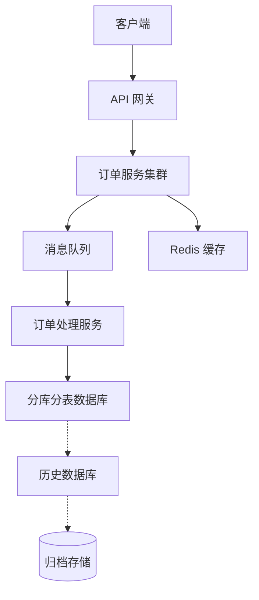

# 五大段落结构详解

本文档详细说明技术方案概要设计文档的五大段落结构，包括各章节的写作要点和逻辑关系。

---

## 目录

1. [五大段落的逻辑关系](#五大段落的逻辑关系)
2. [需求章节](#需求章节)
3. [分析章节](#分析章节)
4. [解决方案章节](#解决方案章节)
5. [待确认项章节](#待确认项章节)
6. [Tasks/实施计划章节](#tasks实施计划章节)
7. [写作流程建议](#写作流程建议)

---

## 五大段落的逻辑关系

五大段落之间存在严密的逻辑递进关系，形成一个完整的问题解决闭环：

```
┌──────────────┐
│   需求        │  ← 问题定义：描述要解决什么问题
└──────┬───────┘
       │
       ▼
┌──────────────┐
│   分析        │  ← 问题拆解：从需求中提炼关键挑战
└──────┬───────┘
       │
       ▼
┌──────────────┐
│  解决方案     │  ← 方案设计：针对挑战点给出解决思路
└──────┬───────┘
       │
       ▼
┌──────────────┐
│  待确认项     │  ← 问题追踪：未解决的挑战点清单
└──────┬───────┘
       │
       ▼
┌──────────────┐
│ Tasks/实施计划 │← 执行落地：基于确定方案制定计划
└──────────────┘
```

### 逻辑验证要点
- **链路完整性**：从需求到实施计划的链条是否完整
- **因果对应**：分析是否准确反映需求，方案是否针对分析
- **闭环检验**：待确认项是否都是方案中未覆盖的问题
- **可执行性**：实施计划是否基于已确认的解决方案

---

## 需求章节

### 章节定位
唯一可以详细描述的章节，尽可能充分描述问题的全貌。

### 推荐结构

```markdown
## 1. 需求

### 1.1 业务背景
描述项目的业务背景、痛点和目标。

#### 1.1.1 现状分析
当前系统的状态、存在的问题。

#### 1.1.2 业务目标
期望达到的业务效果和价值。

### 1.2 功能需求
详细列出功能点清单。

#### 1.2.1 核心功能
- 功能点 1：描述
- 功能点 2：描述

#### 1.2.2 辅助功能
- 功能点 3：描述
- 功能点 4：描述

### 1.3 非功能需求

#### 1.3.1 性能需求
- QPS：10万+
- 响应时间：P99 < 200ms
- 可用性：99.9%

#### 1.3.2 安全需求
- 数据加密、访问控制等

#### 1.3.3 其他需求
可扩展性、可维护性等。

### 1.4 约束条件
- 时间约束：
- 资源约束：
- 技术约束：

### 1.5 假设条件
- 假设 1：
- 假设 2：
```

### 写作要点
1. **充分性**：信息越充分，后续分析越准确
2. **可追溯**：每个需求都应有来源（业务方、用户、法规等）
3. **可度量**：尽量使用可量化的指标
4. **分层表达**：区分业务需求、用户需求、系统需求

### 示例：电商系统订单模块需求

```markdown
## 1. 需求

### 1.1 业务背景
随着业务快速增长，日均订单量从 10 万增长至 50 万，现有订单系统出现性能瓶颈。

**业务目标**：
- 支持日均订单量 100 万
- 订单查询响应时间 < 100ms
- 支持大促期间流量 10 倍峰值

### 1.2 功能需求

#### 1.2.1 订单创建
- 支持多种支付方式（支付宝、微信、银行卡）
- 支持优惠券、积分抵扣
- 订单金额计算准确性 100%

#### 1.2.2 订单查询
- 支持用户端、商家端、运营端查询
- 支持多条件组合查询
- 支持导出功能

#### 1.2.3 订单状态流转
- 待支付 → 已支付 → 待发货 → 已发货 → 已完成
- 支持取消、退款、售后等异常流程

### 1.3 非功能需求

#### 1.3.1 性能指标
- 订单创建 TPS：5000+
- 订单查询 QPS：20000+
- 响应时间：P99 < 200ms

#### 1.3.2 可用性
- 服务可用性：99.9%
- 数据持久性：99.99%

#### 1.3.3 数据一致性
- 订单状态最终一致性
- 支付与订单状态强一致性

### 1.4 约束条件
- 必须在 3 个月内上线
- 预算控制在 50 万以内
- 必须兼容现有 API 接口

### 1.5 假设条件
- 假设第三方支付接口稳定可靠
- 假设网络环境正常，不考虑断网场景
```

---

## 分析章节

### 章节定位
从需求中提炼关键挑战点和技术难点，为解决方案提供靶点。

### 推荐结构

```markdown
## 2. 分析

### 2.1 技术挑战分析

#### 2.1.1 性能挑战
描述性能瓶颈的具体表现。

#### 2.1.2 扩展性挑战
系统如何应对业务增长。

#### 2.1.3 兼容性挑战
与现有系统的兼容问题。

### 2.2 业务挑战分析

#### 2.2.1 流程复杂性
业务逻辑的复杂程度。

#### 2.2.2 合规要求
法规、合规性要求。

### 2.3 资源挑战分析

#### 2.3.1 时间约束
项目时间压力分析。

#### 2.3.2 人力约束
团队能力、人力配置。

#### 2.3.3 成本约束
预算限制分析。
```

### 写作要点
1. **针对性**：每个分析项都要能追溯到具体需求
2. **层次性**：区分主要矛盾和次要矛盾
3. **可解决性**：分析的问题应该是后续能解决或有应对方案的
4. **客观性**：基于事实和数据，而非主观臆断

### 分析模板

```markdown
### X.X 挑战描述

**问题现象**：（描述具体表现）

**影响范围**：（影响的功能、用户、业务）

**严重程度**：（高/中/低）

**相关需求**：（追溯到需求章节的具体条款）

**若不解决的后果**：（对业务、系统的影响）
```

### 示例：电商订单系统分析

```markdown
## 2. 分析

### 2.1 技术挑战分析

#### 2.1.1 高并发下单性能瓶颈
**问题现象**：
- 高峰期数据库写入延迟达到 2-3 秒
- 订单创建接口超时率 5%
- 数据库 CPU 使用率持续 90%+

**影响范围**：
- 用户下单体验差，转化率下降
- 大促期间可能导致系统崩溃

**严重程度**：高

**相关需求**：1.3.1 性能指标

#### 2.1.2 数据量快速增长
**问题现象**：
- 订单表数据量已达 5000 万条
- 查询性能持续下降
- 单表备份时间超过 6 小时

**影响范围**：
- 订单查询响应变慢
- 运维成本增加

**严重程度**：中

#### 2.1.3 分布式事务一致性
**问题现象**：
- 订单创建涉及订单、库存、支付多个服务
- 目前采用最终一致性，偶发数据不一致

**影响范围**：
- 导致超卖或库存积压

**严重程度**：高

### 2.2 业务挑战分析

#### 2.2.1 促销规则复杂多变
**问题现象**：
- 各类促销活动导致订单计算逻辑复杂
- 新业务需求开发周期长

**严重程度**：中

#### 2.2.2 售后流程多样性
**问题现象**：
- 退款、退货、换货等多种售后场景
- 每种场景状态流转不同

**严重程度**：中

### 2.3 资源挑战分析

#### 2.3.1 时间压力
- 距双11大促仅剩 3 个月，时间紧迫
- 需要平衡开发质量和上线时间

#### 2.3.2 团队能力
- 团队对分布式系统经验不足
- 需要时间学习和实践

#### 2.3.3 预算限制
- 硬件预算有限，不能无限扩容
- 需要优化架构提升效率

### 2.4 关键挑战汇总

| 挑战项 | 类型 | 严重程度 | 优先级 | 是否待确认 |
|--------|------|----------|--------|------------|
| 高并发下单性能瓶颈 | 技术 | 高 | P0 | 否 |
| 分布式事务一致性 | 技术 | 高 | P0 | 否 |
| 数据量快速增长 | 技术 | 中 | P1 | 否 |
| 促销规则复杂 | 业务 | 中 | P1 | 是 |
| 时间压力 | 资源 | 高 | P0 | 否 |
```

---

## 解决方案章节

### 章节定位
针对分析章节提出的挑战点，给出解决方案。保持概要化，重点在"是什么"和"为什么"。

### 推荐结构

```markdown
## 3. 解决方案

### 3.1 XXX 挑战的解决方案

#### 3.1.1 方案概述
简要说明方案的整体思路。

#### 3.1.2 方案对比（如适用）
| 方案 | 描述 | 优点 | 缺点 | 成本 |
|------|------|------|------|------|
| A | ... | ... | ... | ... |
| B | ... | ... | ... | ... |

#### 3.1.3 推荐方案
说明推荐哪个方案及理由。

#### 3.1.4 关键技术点（可选）
简要阐述关键技术的实现思路。

### 3.2 YYY 挑战的解决方案
...
```

### 写作要点
1. **对应性**：每个解决方案都应针对分析中的一个或多个挑战
2. **完整性**：重要的技术决策都要有方案对比
3. **适度性**：概要描述，避免过度技术细节
4. **一致性**：方案之间要逻辑自洽，不相互矛盾

### 解决方案模板

```markdown
### X.X 挑战的解决方案

**问题回顾**：简要回顾要解决的挑战

**方案目标**：期望达到的效果

**方案 A：XXXX**
- **设计思路**：
- **技术要点**：
- **优点**：
- **缺点**：
- **适用场景**：

**方案 B：YYYY**
（同上结构）

**方案对比分析**：
| 维度 | 方案 A | 方案 B |
|------|--------|--------|
| 功能性 | ⭐⭐⭐⭐⭐ | ⭐⭐⭐⭐ |
| 性能 | ⭐⭐⭐ | ⭐⭐⭐⭐⭐ |
| 成本 | ⭐⭐⭐⭐⭐ | ⭐⭐⭐ |
| 风险 | ⭐⭐⭐ | ⭐⭐⭐⭐ |

**推荐方案**：X
**推荐理由**：
1. 理由 1
2. 理由 2

**实施要点**：
- 关键点 1：简要说明
- 关键点 2：简要说明
```

### 示例：电商订单系统解决方案

```markdown
## 3. 解决方案

### 3.1 高并发下单性能优化方案

**问题回顾**：高峰期数据库写入延迟高，订单创建接口超时

**方案目标**：支持 5000+ TPS 的订单创建，P99 延迟 < 200ms

#### 3.1.1 方案对比

| 方案 | 描述 | 优点 | 缺点 | 实施成本 |
|------|------|------|------|----------|
| A: 读写分离 | 主库写入，从库查询 | 实施简单、成本低 | 只能缓解查询压力 | 低 |
| B: 分库分表 | 按 user_id 水平分片 | 扩展性好、效果显著 | 改造复杂、跨库查询难 | 中 |
| C: 缓存+队列 | Redis 缓存 + MQ 削峰 | 性能最好、扩展性强 | 架构复杂、维护成本高 | 高 |

#### 3.1.2 推荐方案：综合方案（B + C）

**推荐理由**：
1. **满足业务目标**：方案 B 解决数据容量问题，方案 C 解决并发性能问题
2. **良好的扩展性**：支持水平扩展，可应对未来业务增长
3. **风险可控**：业界有大量成功案例，团队可以借鉴经验

**架构设计**：
```
客户端 → API 网关 → 订单服务集群
                    ↓
             消息队列（削峰）
                    ↓
             订单处理服务 → 分库分表数据库
                    ↓
             Redis 缓存（热点数据）
```

**关键技术点**：
1. **分片策略**：按 user_id 取模分 16 个库，每个库 64 张表
2. **分布式 ID**：使用雪花算法生成全局唯一订单 ID
3. **异步处理**：非核心流程（日志、通知）异步化
4. **缓存策略**：热点商品信息、用户配置等缓存到 Redis

#### 3.1.3 实施要点

**分库分表实施**：
- 采用中间件方案（如 ShardingSphere）降低改造难度
- 历史数据迁移采用双写方案，确保数据一致性
- 灰度发布，先迁移 10% 流量，验证无误后全量

**消息队列选型**：
- 使用 RocketMQ，支持高吞吐和可靠投递
- 配置死信队列，处理异常订单
- 消息幂等性设计，防止重复创建订单

### 3.2 分布式事务一致性方案

**问题回顾**：订单、库存、支付跨服务，数据一致性保障困难

**推荐方案：TCC 补偿事务 + 可靠消息**

**方案设计**：
1. **Try 阶段**：
   - 冻结库存
   - 创建预订单（状态：待确认）
   - 冻结用户优惠券

2. **Confirm 阶段**：
   - 扣减库存（冻结转实际扣减）
   - 订单状态更新为已支付
   - 优惠券标记为已使用

3. **Cancel 阶段**（异常回滚）：
   - 释放冻结库存
   - 删除预订单
   - 释放优惠券

**异常处理**：
- 超时自动 Cancel
- 定期对账，发现不一致自动补偿
- 人工干预机制

### 3.3 数据量增长应对方案

**推荐方案：冷热分离 + 归档策略**

**设计思路**：
- **热数据**：近 3 个月的订单留在主库
- **温数据**：3-12 个月的订单迁移到历史库
- **冷数据**：1 年前的订单归档到 OSS

**实施策略**：
- 归档任务每天凌晨执行
- 归档前数据校验，确保数据完整性
- 提供归档数据查询接口（响应时间可接受）

### 3.4 促销规则灵活性方案

🔍 **待讨论项**（详见章节 4.1）

### 3.5 解决方案整体架构



**各组件职责**：
| 组件 | 职责 | 技术选型 | 部署规模 |
|------|------|----------|----------|
| API 网关 | 流量入口、限流、认证 | Kong | 3 节点 |
| 订单服务 | 订单校验、创建预订单 | Spring Boot | 20 节点 |
| 消息队列 | 流量削峰、异步处理 | RocketMQ | 5 主 5 从 |
| 订单处理 | 订单持久化、状态更新 | Spring Boot | 10 节点 |
| 数据库 | 订单数据存储 | MySQL | 16 库 × 64 表 |
| Redis | 热点数据缓存 | Redis Cluster | 3 主 3 从 |
```

---

## 待确认项章节

### 章节定位
收集解决方案中悬而未决的问题，需要讨论确认的事项。本章节体现方案的严谨性和实事求是的态度。

### 推荐结构

```markdown
## 4. 待确认项

### 4.1 技术选型待确认
1. **技术选型 X**：
   - 待确认内容：
   - 影响范围：
   - 建议方案：
   - 需要输入：

### 4.2 业务规则待确认
2. **业务规则 X**：
   - 待确认内容：
   - 影响范围：
   - 相关方：
   - 建议：

### 4.3 架构设计待确认
3. **架构决策 X**：
   - 待确认内容：
   - 技术方案对比：
   - 决策影响：
   - 建议：

### 4.4 资源协调待确认
4. **资源需求 X**：
   - 待确认内容：
   - 影响范围：
   - 相关方：
   - 建议：

### 4.5 时间节点待确认
5. **项目计划 X**：
   - 待确认内容：
   - 影响范围：
   - 风险：
   - 建议：
```

### 写作要点
1. **完整性**：涵盖技术、业务、资源等各个维度
2. **清晰性**：明确说明待确认的具体内容
3. **影响分析**：说明不确认的影响范围和后果
4. **推进建议**：给出推进确认的建议方案
5. **责任明确**：建议相关责任方或决策方

### 待确认项模板

```markdown
### X.X 待确认事项标题

**待确认内容**：
明确说明待确认的具体问题，避免模糊不清

**背景说明**：
说明问题的来由和上下文

**影响分析**：
| 影响维度 | 具体影响 | 严重程度 |
|----------|----------|----------|
| 技术 | 影响架构设计 | 高 |
| 业务 | 影响用户体验 | 中 |
| 时间 | 可能影响上线时间 | 高 |

**可选方案**（如适用）：
| 方案 | 说明 | 优缺点 |
|------|------|--------|
| A | ... | ... |
| B | ... | ... |

**推进建议**：
1. 建议的确认方式（会议、文档、评审等）
2. 建议的参与方
3. 预期解决时间

**相关文档**：
链接到相关背景文档或讨论记录
```

### 示例：电商订单系统待确认项

```markdown
## 4. 待确认项

### 4.1 技术选型待确认

#### 4.1.1 规则引擎选型
**待确认内容**：
- 是否引入 Drools 等规则引擎管理促销规则
- 还是用策略模式硬编码在代码中

**背景说明**：
促销规则复杂多变，目前已支持 10+ 种促销类型，后续还会增加。

**影响分析**：
- **技术架构**：决定促销模块的设计和实现
- **开发效率**：规则引擎可提高开发效率，但增加学习成本
- **性能表现**：规则引擎性能略低于硬编码

**方案对比**：
| 方案 | 实现成本 | 灵活性 | 性能 | 维护成本 | 学习成本 |
|------|----------|--------|------|----------|----------|
| Drools | 中 | ⭐⭐⭐⭐⭐ | ⭐⭐⭐ | ⭐⭐ | ⭐⭐⭐⭐ |
| QLExpress | 低 | ⭐⭐⭐⭐ | ⭐⭐⭐⭐ | ⭐⭐⭐ | ⭐⭐ |
| 硬编码 | 低 | ⭐⭐ | ⭐⭐⭐⭐⭐ | ⭐⭐⭐⭐ | ⭐ |

**推进建议**：
1. 组织技术选型评审会
2. 邀请：架构组、促销业务负责人、核心开发
3. 准备：各方案 POC 对比
4. 目标时间：2024-02-15 前确定

**相关人员**：
- 技术负责人：张三
- 业务负责人：李四

#### 4.1.2 分库分表分片键选择
**待确认内容**：
- 按 user_id 分片还是按 order_id 分片

**背景说明**：
- user_id 分片：符合查询场景（用户查订单）
- order_id 分片：分布更均匀，可避免热点

**影响分析**：
- 决定分库分表的架构设计
- 影响跨用户查询的实现复杂度

**推荐方案**：按 user_id 分片
**理由**：主要查询场景是按用户维度

**推进建议**：
- 与 DBA 团队确认
- 时间：2024-02-10 前

### 4.2 业务规则待确认

#### 4.2.1 订单超时时间设定
**待确认内容**：
- 未支付订单自动关闭的时间：15 分钟、30 分钟还是 1 小时

**背景说明**：
- 太短：用户支付时间不足
- 太长：占用库存时间久

**影响分析**：
- 用户体验：支付成功率
- 库存周转：影响库存释放速度

**相关方**：
- 产品：负责决策
- 运营：提供业务数据支持

**推进建议**：
1. 分析历史订单支付时长数据
2. 与产品团队讨论确定
3. 目标时间：2024-02-08

#### 4.2.2 库存扣减时机
**待确认内容**：
- 创建订单时扣减库存还是支付成功后扣减

**背景说明**：
- 下单扣库存：避免超卖，但可能被恶意占用
- 支付扣库存：减少无效占用，但有超卖风险

**影响分析**：
- 超卖风险：影响合规性和用户体验
- 恶意占库存：影响正常销售

**相关方**：
- 产品：决策
- 风控：提供风控建议

**推进建议**：
- 参考行业通用做法
- 评估风控能力
- 建议会议讨论

### 4.3 架构设计待确认

#### 4.3.1 是否采用事件溯源架构
**待确认内容**：
- 是否采用 Event Sourcing 模式记录订单状态变更

**背景说明**：
- 传统方案：记录当前状态
- 事件溯源：记录完整的变更历史

**方案对比**：
| 维度 | 传统方案 | 事件溯源 |
|------|----------|----------|
| 实现复杂度 | 低 | 高 |
| 溯源能力 | 有限 | 强 |
| 查询性能 | 高 | 需要 CQRS |
| 适用场景 | 简单流程 | 复杂状态机 |

**推进建议**：
- 暂不采用，保持架构简单
- 后续根据业务发展评估
- 当前通过操作日志满足审计需求

### 4.4 资源协调待确认

#### 4.4.1 测试环境资源
**待确认内容**：
- 需要多少套测试环境（开发、集成、压测、预发）
- 每套环境的资源配置

**背景说明**：
团队有 20 个开发，并行开发多个需求。

**影响分析**：
- 影响开发和测试效率
- 环境成本预算

**推进建议**：
- 与运维团队评估现有资源
- 目标时间：2024-02-05

#### 4.4.2 Redis 集群机器资源
**待确认内容**：
- Redis 集群规模：2 主 2 从还是 3 主 3 从
- 机器配置：16G/32G/64G

**背景说明**：
目前评估需要缓存 20GB 热点数据。

**推进建议**：
- 与运维和预算部门确认
- 目标时间：2024-02-10

### 4.5 时间节点待确认

#### 4.5.1 项目里程碑
**待确认内容**：
- 需求评审完成时间：2024-02-08 还是 02-12
- 开发完成时间：2024-02-28 还是 03-05

**背景说明**：
业务希望尽快上线，但技术评估需要更充分时间。

**影响分析**：
- 影响项目计划安排
- 影响团队工作节奏

**推进建议**：
- 与技术团队充分沟通工作量
- 与业务对齐期望
- 考虑风险 buffer

#### 4.5.2 上线时间窗口
**待确认内容**：
- 上线时间：3 月 15 日前还是 3 月底

**背景说明**：
- 3 月 15 日：可以赶上 321 大促
- 3 月底：时间更充分，风险更低

**相关方**：
- 业务：希望早点上线
- 技术：希望充分测试

**推进建议**：
- 评估开发进度和测试覆盖率
- 建议：3 月 20 日上线
- 既能赶上大促，又有充分测试时间

---

## Tasks/实施计划章节

### 章节定位
基于已确定的解决方案，制定可执行的实施计划。本章节的完成标志着文档进入可执行阶段。

### 推荐结构

```markdown
## 5. Tasks/实施计划

### 5.1 里程碑规划

#### 5.1.1 Phase 1：需求与设计（2 周）
- M1：需求评审完成
- M2：概要设计评审

#### 5.1.2 Phase 2：核心开发（3 周）
- M3：分库分表完成
- M4：消息队列集成

#### 5.1.3 Phase 3：系统集成（2 周）
- M5：全链路测试
- M6：性能压测

#### 5.1.4 Phase 4：上线准备（1 周）
- M7：生产环境部署
- M8：上线方案评审

### 5.2 详细任务分解

#### 5.2.1 需求阶段
- Task-001：需求评审
- Task-002：技术方案设计
- Task-003：方案评审

#### 5.2.2 开发阶段
...（按模块分解）

#### 5.2.3 测试阶段
...（按测试类型分解）

#### 5.2.4 上线阶段
...（按上线步骤分解）

### 5.3 资源规划

#### 5.3.1 人力投入
| 角色 | 人数 | 工作量（人日） | 备注 |
|------|------|----------------|------|
| 后端开发 | 4 | 80 | 含技术负责人 |
| 测试 | 2 | 40 | 含性能测试 |
| DBA | 1 | 20 | 分库分表支持 |

#### 5.3.2 环境资源
- 开发环境：xx
- 测试环境：xx
- 预发环境：xx
- 生产环境：xx

### 5.4 风险评估与应对

#### 5.4.1 技术风险
| 风险 | 可能性 | 影响 | 应对措施 | 负责人 |
|------|--------|------|----------|--------|
| 分库分表延迟 | 中 | 高 | 提前准备回滚方案 | 张三 |

#### 5.4.2 项目管理风险
| 风险 | 可能性 | 影响 | 应对措施 | 负责人 |
|------|--------|------|----------|--------|
| 需求变更 | 高 | 中 | 建立需求变更流程 | 李四 |

### 5.5 TODO 清单

#### 已确认的 TODO
- [ ] Task-001：需求评审（截止时间：2024-02-08）
- [ ] Task-002：分库分表设计（截止时间：2024-02-12）

#### 待确认的 TODO（依赖确认项）
- [ ] Task-XXX：规则引擎集成（依赖 4.1.1 确认结果）
```

### 写作要点
1. **可执行性**：任务分解要细致到可执行级别
2. **可追踪性**：每个任务都有明确的责任人和时间节点
3. **可验证性**：任务完成标准要清晰可验证
4. **完整性**：覆盖从需求到上线的全流程
5. **灵活性**：对风险有预判和应对方案

### 任务分解原则

#### 原则 1：SMART 原则
- **S**pecific（具体的）
- **M**easurable（可衡量的）
- **A**chievable（可实现的）
- **R**elevant（相关的）
- **T**ime-bound（有时限的）

#### 原则 2：WBS 分解
- 按阶段分解
- 按模块分解
- 按职能分解

#### 原则 3：依赖识别
- 前置依赖：本任务开始前必须完成的工作
- 后置依赖：依赖本任务的其他工作
- 并行任务：可同时进行的任务

### 示例：电商订单系统实施计划

```markdown
## 5. Tasks/实施计划

### 5.1 里程碑规划

| 里程碑 | 目标 | 计划完成时间 | 负责人 | 状态 |
|--------|------|--------------|--------|------|
| M1 | 需求评审完成 | 2024-02-08 | 产品 | 规划中 |
| M2 | 技术方案评审 | 2024-02-15 | 架构师 | 规划中 |
| M3 | 分库分表完成 | 2024-02-28 | 技术负责人 | 规划中 |
| M4 | 消息队列集成 | 2024-03-05 | 技术负责人 | 规划中 |
| M5 | 全功能测试完成 | 2024-03-10 | 测试负责人 | 规划中 |
| M6 | 性能压测通过 | 2024-03-15 | 测试负责人 | 规划中 |
| M7 | 生产部署完成 | 2024-03-20 | 运维负责人 | 规划中 |
| M8 | 正式上线 | 2024-03-22 | 项目经理 | 规划中 |

### 5.2 详细任务分解

#### 5.2.1 需求与方案阶段（第 1-2 周）

**Task-001：业务需求评审**
- **负责人**：产品经理
- **参与人员**：技术团队、测试团队
- **工作量**：2 人日
- **前置条件**：无
- **产出物**：需求评审会议纪要、确认的需求文档
- **完成标准**：与业务方达成需求一致
- **截止时间**：2024-02-08

**Task-002：技术方案设计**
- **负责人**：技术负责人
- **参与人员**：核心开发、架构师、DBA
- **工作量**：5 人日
- **前置条件**：Task-001
- **产出物**：概要设计文档、技术选型报告
- **完成标准**：完成五大段落文档编写
- **截止时间**：2024-02-12

**Task-003：技术方案评审**
- **负责人**：技术负责人
- **参与人员**：架构委员会、相关团队
- **工作量**：1 人日
- **前置条件**：Task-002
- **产出物**：评审会议纪要、待确认事项清单
- **完成标准**：架构评审通过，待确认事项明确
- **截止时间**：2024-02-15

#### 5.2.2 核心开发阶段（第 3-5 周）

**Task-101：分库分表方案实施**
- **负责人**：DBA + 技术负责人
- **工作量**：10 人日
- **前置条件**：Task-003
- **产出物**：分库分表配置、数据迁移脚本
- **完成标准**：
  - [ ] 16 库 64 表创建完成
  - [ ] 分片规则配置完成
  - [ ] 历史数据迁移方案确认
- **截止时间**：2024-02-28

**Task-102：订单服务分库分表改造**
- **负责人**：后端开发 A、B
- **工作量**：15 人日
- **前置条件**：Task-101
- **产出物**：改造后的订单服务代码
- **完成标准**：
  - [ ] MyBatis 配置改造完成
  - [ ] 查询语句优化完成
  - [ ] 单元测试通过率 100%
- **截止时间**：2024-03-05

**Task-103：Redis 集群搭建**
- **负责人**：运维工程师
- **工作量**：3 人日
- **前置条件**：资源到位（依赖 4.4.2 确认）
- **产出物**：Redis 集群环境
- **完成标准**：
  - [ ] 3 主 3 从集群部署完成
  - [ ] 监控告警配置完成
  - [ ] 压测通过
- **截止时间**：2024-02-25

**Task-104：消息队列集成**
- **负责人**：后端开发 C、D
- **工作量**：10 人日
- **前置条件**：Task-003
- **产出物**：消息队列生产者和消费者代码
- **完成标准**：
  - [ ] RocketMQ 集成完成
  - [ ] 订单创建消息接入完成
  - [ ] 死信队列配置完成
  - [ ] 消息幂等性实现
- **截止时间**：2024-03-05

**Task-105：库存服务 TCC 改造**
- **负责人**：后端开发 E
- **工作量**：8 人日
- **前置条件**：Task-003
- **产出物**：TCC 接口实现
- **完成标准**：
  - [ ] Try 接口实现
  - [ ] Confirm 接口实现
  - [ ] Cancel 接口实现
  - [ ] 幂等性控制
- **截止时间**：2024-03-08

**Task-106：缓存策略实施**
- **负责人**：后端开发 A
- **工作量**：5 人日
- **前置条件**：Task-103
- **产出物**：缓存实现代码
- **完成标准**：
  - [ ] 热点商品缓存完成
  - [ ] 用户配置缓存完成
  - [ ] 缓存更新策略实现
  - [ ] 缓存穿透保护
- **截止时间**：2024-03-10

#### 5.2.3 集成测试阶段（第 6-7 周）

**Task-201：单元测试**
- **负责人**：各开发
- **工作量**：12 人日
- **前置条件**：各开发任务完成
- **完成标准**：
  - [ ] 代码覆盖率 > 80%
  - [ ] 核心逻辑覆盖率 100%
- **截止时间**：2024-03-10

**Task-202：接口测试**
- **负责人**：测试工程师
- **工作量**：5 人日
- **前置条件**：Task-201
- **产出物**：接口测试用例、测试报告
- **完成标准**：
  - [ ] 主流程接口测试通过
  - [ ] 异常场景测试通过
- **截止时间**：2024-03-12

**Task-203：集成测试**
- **负责人**：测试工程师
- **工作量**：8 人日
- **前置条件**：Task-202
- **产出物**：集成测试报告
- **完成标准**：
  - [ ] 业务流程端到端测试通过
  - [ ] 与支付系统集成测试通过
  - [ ] 与库存系统集成测试通过
- **截止时间**：2024-03-15

**Task-204：性能压测**
- **负责人**：测试负责人 + DBA
- **工作量**：10 人日
- **前置条件**：Task-203
- **产出物**：性能测试报告
- **测试场景**：
  - [ ] 订单创建 TPS 5000+
  - [ ] 订单查询 QPS 20000+
  - [ ] 混合场景稳定性测试（24 小时）
- **完成标准**：
  - [ ] 所有场景达到性能指标
  - [ ] 无内存泄漏
  - [ ] 无性能衰减
- **截止时间**：2024-03-18

**Task-205：数据迁移测试**
- **负责人**：DBA + 测试工程师
- **工作量**：5 人日
- **前置条件**：Task-101
- **产出物**：数据迁移测试报告
- **完成标准**：
  - [ ] 历史数据完整迁移
  - [ ] 数据一致性校验 100%
  - [ ] 增量数据同步测试通过
  - [ ] 回滚方案验证
- **截止时间**：2024-03-15

#### 5.2.4 上线准备阶段（第 8 周）

**Task-301：生产环境准备**
- **负责人**：运维工程师
- **工作量**：5 人日
- **前置条件**：
- **产出物**：生产环境配置
- **完成标准**：
  - [ ] 16 库 64 表生产环境创建
  - [ ] Redis 生产集群部署
  - [ ] 应用服务器部署
  - [ ] 监控告警配置
- **截止时间**：2024-03-20

**Task-302：上线方案编写**
- **负责人**：技术负责人
- **工作量**：3 人日
- **前置条件**：Task-204
- **产出物**：上线方案文档
- **包含内容**：
  - [ ] 上线步骤清单
  - [ ] 回滚方案
  - [ ] 应急预案
  - [ ] 验证清单
  - [ ] 责任人分工
- **截止时间**：2024-03-18

**Task-303：上线方案评审**
- **负责人**：项目经理
- **工作量**：1 人日
- **前置条件**：Task-302
- **参与人员**：技术团队、运维、测试、产品
- **产出物**：评审意见、上线方案终版
- **完成标准**：上线方案评审通过
- **截止时间**：2024-03-20

**Task-304：用户培训**
- **负责人**：产品经理
- **工作量**：2 人日
- **前置条件**：Task-203
- **培训对象**：客服、运营
- **产出物**：培训材料、操作手册
- **完成标准**：相关人员培训完成
- **截止时间**：2024-03-20

**Task-305：上线演练**
- **负责人**：技术负责人 + 运维
- **工作量**：2 人日
- **前置条件**：Task-303
- **演练内容**：
  - [ ] 发布流程演练
  - [ ] 回滚流程演练
  - [ ] 应急预案演练
- **完成标准**：演练通过，团队熟悉流程
- **截止时间**：2024-03-21

**Task-306：数据迁移实施**
- **负责人**：DBA
- **工作量**：1 人日（实际执行）
- **前置条件**：Task-301, Task-205
- **实施内容**：
  - [ ] 历史数据迁移
  - [ ] 增量数据同步
  - [ ] 数据一致性校验
- **完成标准**：数据全部迁移并验证通过
- **执行时间**：上线当天

### 5.2.5 上线发布

**Task-401：正式发布**
- **负责人**：技术负责人
- **工作量**：1 人日
- **前置条件**：所有前置任务完成
- **执行时间**：2024-03-22 02:00-06:00（业务低峰期）
- **执行步骤**：
  1. 停止旧系统写入（02:00）
  2. 执行数据迁移（02:00-03:00）
  3. 部署新系统（03:00-04:00）
  4. 验证核心流程（04:00-05:00）
  5. 切换流量（05:00）
  6. 监控观察（05:00-06:00）

**Task-402：上线后监控**
- **负责人**：运维 + 技术负责人
- **周期**：7 天
- **监控项**：
  - [ ] 系统性能指标（每分钟）
  - [ ] 错误日志（实时告警）
  - [ ] 业务指标（每小时）
  - [ ] 用户反馈（每日汇总）

### 5.3 资源规划

#### 5.3.1 人力资源投入

| 角色 | 人数 | 工作量（人日） | 峰值投入 | 备注 |
|------|------|----------------|----------|------|
| 产品经理 | 1 | 10 | 1 | 需求 + 验收 |
| 技术负责人 | 1 | 25 | 1 | 架构 + 协调 |
| 后端开发 | 4 | 95 | 4 | 核心开发 |
| DBA | 1 | 20 | 1 | 数据库支持 |
| 测试工程师 | 2 | 40 | 2 | 功能+性能测试 |
| 运维工程师 | 1 | 15 | 1 | 环境+部署 |
| **合计** | **10** | **205** | **10** | **峰值 10 人** |

**人力投入曲线**：
```
Week 1-2:  ▓▓▓▓░░░░░░ 设计阶段（4 人）
Week 3-5:  ▓▓▓▓▓▓▓▓▓▓ 开发阶段（10 人）
Week 6-7:  ▓▓▓▓▓▓▓▓░░ 测试阶段（8 人）
Week 8:    ▓▓▓▓▓▓░░░░ 上线阶段（6 人）
```

#### 5.3.2 环境资源需求

**测试环境**：
- 开发环境：5 套（每个后端 1 套）
- 集成环境：2 套（主、备）
- 压测环境：1 套（等同生产配置）
- 预发环境：1 套（生产镜像）

**生产环境**：
- 应用服务器：30 台（预留 20% 冗余）
- 数据库：16 实例（每实例 64 表）
- Redis：6 实例（3 主 3 从）
- 消息队列：10 实例（5 主 5 从）

### 5.4 风险评估与应对

#### 5.4.1 技术风险

| 风险描述 | 可能性 | 影响程度 | 风险等级 | 应对措施 | 责任人 | 监控指标 |
|----------|--------|----------|----------|----------|--------|----------|
| 分库分表导致性能下降 | 中 | 高 | 高 | 1. 充分压测<br>2. 准备回滚方案 | DBA | TPS 下降 > 20% 触发告警 |
| Redis 集群不稳定 | 低 | 高 | 中 | 1. 高可用配置<br>2. 降级方案 | 运维 | Redis 可用性 < 99.9% |
| 消息队列消息丢失 | 低 | 高 | 中 | 1. 持久化配置<br>2. 对账补偿 | 开发 | 消息投递成功率 |
| 分布式事务一致性失败 | 中 | 高 | 高 | 1. TCC 完整实现<br>2. 定时对账 | 开发 | 一致性检查失败数 |

#### 5.4.2 项目管理风险

| 风险描述 | 可能性 | 影响程度 | 风险等级 | 应对措施 | 责任人 |
|----------|--------|----------|----------|----------|--------|
| 需求变更 | 高 | 中 | 中 | 建立变更流程，评估影响 | 项目经理 |
| 关键人员离职 | 低 | 高 | 中 | 代码评审、文档完善、backup 培养 | 技术负责人 |
| 第三方依赖延迟 | 中 | 中 | 中 | 提前沟通，准备替代方案 | 项目经理 |
| 测试环境不稳定 | 中 | 中 | 中 | 环境隔离，定期维护 | 运维 |

#### 5.4.3 业务风险

| 风险描述 | 可能性 | 影响程度 | 风险等级 | 应对措施 | 责任人 |
|----------|--------|----------|----------|----------|--------|
| 上线后用户投诉增加 | 中 | 中 | 中 | 1. 充分测试<br>2. 用户培训<br>3. 客服预案 | 产品 |
| 大促期间流量超预期 | 中 | 高 | 高 | 1. 弹性伸缩<br>2. 限流降级<br>3. 应急预案 | 技术负责人 |

### 5.5 TODO 清单

#### 已确认的 TODO
- [X] Task-001：需求评审（截止时间：2024-02-08）
- [ ] Task-002：技术方案设计（截止时间：2024-02-12）
- [ ] Task-101：分库分表方案实施（截止时间：2024-02-28）
- [ ] Task-102：订单服务改造（截止时间：2024-03-05）

#### 依赖待确认项的 TODO
- [ ] Task-XXX：引入规则引擎（依赖 4.1.1 确认结果）
  - 如确认使用 Drools：需要额外 5 人日
  - 如确认不使用：在代码中实现策略模式
- [ ] Task-YYY：数据库分片键实施（依赖 4.1.2 确认结果）
- [ ] Task-ZZZ：Redis 集群规模（依赖 4.4.2 确认结果）
```

---

## 写作流程建议

### 推荐写作顺序

```
步骤 1：理解需求（充分沟通）
    ↓
步骤 2：撰写【需求】章节（详细）
    ↓
步骤 3：撰写【分析】章节（提炼挑战）
    ↓
步骤 4：撰写【解决方案】章节（概要）
    ↓
步骤 5：同步更新【待确认项】章节
    ↓
步骤 6：讨论确认（评审待确认项）
    ↓
步骤 7：完善【解决方案】章节
    ↓
步骤 8：撰写【Tasks/实施计划】章节
    ↓
步骤 9：全文审核（逻辑闭环）
    ↓
步骤 10：生成配套图表
```

### 关键检查点

#### 检查点 1：需求完整性
- [ ] 是否充分理解业务需求和痛点？
- [ ] 是否明确非功能需求（性能、安全、可靠性）？
- [ ] 是否了解约束条件（时间、资源、技术）？

#### 检查点 2：分析准确性
- [ ] 每个挑战是否能追溯到具体需求？
- [ ] 是否区分了主要矛盾和次要矛盾？
- [ ] 分析深度是否足够支撑方案设计？

#### 检查点 3：方案对应性
- [ ] 是否每个挑战都有对应的解决方案？
- [ ] 无对应方案的挑战是否移入"待确认项"？
- [ ] 方案之间是否逻辑自洽？

#### 检查点 4：待确认项完整性
- [ ] 是否涵盖了技术、业务、资源等维度？
- [ ] 每个项是否有明确的影响分析？
- [ ] 是否有推进计划和相关方？

#### 检查点 5：实施计划可行性
- [ ] 任务分解是否足够细致？
- [ ] 时间估算是否合理（考虑 buffer）？
- [ ] 资源规划是否匹配实际？
- [ ] 风险应对是否充分？

#### 检查点 6：全文一致性
- [ ] 需求 → 分析 → 方案逻辑链条是否完整？
- [ ] 数据指标是否前后一致？
- [ ] 技术决策理由是否充分？
- [ ] 图表是否最新版本？

### 常见写作误区

#### 误区 1：需求章节过于简单
**问题**：需求描述不清，导致后续分析和方案偏差
**应对**：投入足够时间理解需求，与业务方充分沟通

#### 误区 2：分析章节遗漏关键点
**问题**：只看到表面问题，未挖掘深层挑战
**应对**：从技术、业务、资源多角度分析，与团队讨论

#### 误区 3：解决方案过度详细
**问题**：陷入技术细节，写成详细设计文档
**应对**：牢记"概要"定位，关注"是什么"和"为什么"

#### 误区 4：待确认项过少
**问题**：为了显示方案完整，回避待确认问题
**应对**：实事求是，充分暴露需要确认的问题

#### 误区 5：实施计划过于乐观
**问题**：低估难度，时间安排不合理
**应对**：充分评估，预留 buffer，考虑风险

#### 误区 6：前后不一致
**问题**：需求、分析、方案中的数据、指标不一致
**应对**：全文完成后，通篇检查一致性

### 协作建议

#### 与业务方协作
- **时机**：需求阶段、方案评审、待确认项讨论
- **内容**：业务需求确认、业务规则明确、验收标准对齐
- **输出**：需求签字确认、会议纪要、邮件确认

#### 与技术团队协作
- **时机**：分析阶段、方案设计、技术评审
- **内容**：技术挑战分析、方案可行性评估、技术选型
- **输出**：技术评审意见、方案决策记录

#### 与测试团队协作
- **时机**：方案设计、测试计划制定、上线准备
- **内容**：可测试性设计、测试方案确认、验收标准
- **输出**：测试计划、测试用例评审、验收报告

#### 与运维团队协作
- **时机**：方案设计、资源规划、上线准备
- **内容**：部署方案、资源需求、监控告警
- **输出**：部署计划、应急预案、上线检查清单

#### 与 DBA 协作
- **时机**：方案设计、分库分表实施、性能优化
- **内容**：数据库设计、SQL 优化、容量规划
- **输出**：数据库设计文档、性能测试报告

### 文档迭代管理

#### 版本控制建议
```markdown
# 文档信息
- 创建日期：2024-02-01
- 创建人：张三
- 文档版本：v0.1（草稿）

## 版本历史
| 版本 | 日期 | 修订内容 | 修订人 | 审核人 |
|------|------|----------|--------|--------|
| v0.1 | 2024-02-01 | 初稿 | 张三 | 待审核 |
| v0.2 | 2024-02-05 | 补充性能测试数据 | 张三 | 李四 |
| v0.3 | 2024-02-08 | 根据评审意见修改 | 张三 | 王五 |
| v1.0 | 2024-02-10 | 正式发布版本 | 张三 | - |

## 最近更新
- 2024-02-10：完成待确认项讨论，更新方案
- 2024-02-08：增加性能压测数据
- 2024-02-05：补充风险应对方案
```

#### 变更管理
- **小修改**（错别字、格式）：直接更新，记录变更
- **中修改**（局部调整）：明确变更范围，通知相关人员
- **大修改**（结构调整）：重新评审，更新版本号
- **待确认项更新**：实时同步，通知相关方

### 配套文件管理

#### 必备配套文件
1. **架构图**：整体架构、逻辑架构、物理架构
2. **C4 图**：系统上下文、容器、组件图
3. **流程图**：业务流程、数据流程、时序图
4. **数据模型**：ER 图、数据字典
5. **接口文档**：API 清单、接口定义

#### 配套文件命名规范
```
主文档：
  order-system-preliminary-design-20240210.md

架构图：
  order-system-architecture.drawio
  order-system-architecture.png

C4图：
  order-system-c4-context.md
  order-system-c4-container.md
  order-system-c4-component.md

流程图：
  order-system-flow-business.md
  order-system-flow-data.md
  order-system-sequence-create-order.md

数据：
  order-system-data-model.md
  order-system-data-dictionary.md

接口：
  order-system-api-list.md
  order-system-api-contract.md
```

#### 版本一致性管理
- 主文档修改后，检查配套文件是否需要更新
- 配套文件更新后，检查文档中的引用是否有效
- 定期（每周）检查配套文件的版本一致性
- 使用版本号标记配套文件和主文档的对应关系

### 评审与优化

#### 评审要点
1. **逻辑评审**：五大段落逻辑是否闭环
2. **技术评审**：方案的技术可行性
3. **业务评审**：是否满足业务需求
4. **资源评审**：资源配置是否合理
5. **风险评审**：风险识别是否充分

#### 优化方向
1. **精简内容**：删除冗余描述，保持简洁
2. **强化逻辑**：优化论证过程，增强说服力
3. **补充数据**：用数据支撑决策和结论
4. **完善风险**：充分识别风险
5. **细化计划**：任务分解更细致

---

## 总结

五大段落结构的核心价值：
1. **逻辑清晰**：问题 → 分析 → 方案 → 确认 → 执行的完整链条
2. **重点突出**：概要设计的定位，避免过度技术细节
3. **实事求是**：承认待确认事项，体现严谨性
4. **可执行性**：明确的计划和风险应对
5. **团队协作**：支持多方协作和评审

优秀的技术方案文档应该是：
- **完整覆盖**：涵盖需求、分析、方案、计划
- **层次分明**：主次清晰，详略得当
- **逻辑严密**：前后一致，环环相扣
- **文档完备**：配套图表齐全，版本一致
- **实事求是**：问题明确，方案可行

---

*本指南与 SKILL.md 配合使用，如需了解具体写作规范，请参考 SKILL.md。*
